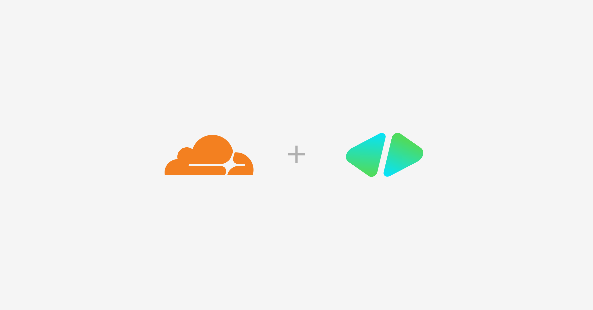

# HyperFrames on Cloudflare



<!-- dash-content-start -->

A drop-in cloud renderer for [HyperFrames](https://github.com/heygen-com/hyperframes) projects. Clone it as a nested sub-folder inside an existing HyperFrames project; it picks up the parent's composition and assets, deploys a [Cloudflare Container](https://developers.cloudflare.com/containers/) (Chromium + FFmpeg), and renders MP4s into [R2](https://developers.cloudflare.com/r2/).

```
my-hyperframes-project/
├── index.html            # your composition
├── assets/
└── cloudflare-render/    # ← this template, dropped in
```

Demonstrates Worker-to-Container fetching via Durable Object bindings, streaming response bodies through the Worker into R2, and bundling sub-compositions into a single self-contained preview HTML at build time.

<!-- dash-content-end -->

Deploying provisions a Worker (`hyperframes-<your-project>`), the `RenderContainer` Durable Object, and an R2 bucket (`hyperframes-<your-project>-renders`). All names derive from the parent project's `package.json` `name` field — no manual config edits needed. Cloudflare Containers requires a [Workers Paid](https://developers.cloudflare.com/workers/platform/pricing/) plan.

## Quickstart

```bash
# from inside your HyperFrames project root
git clone https://github.com/picsoung/hyperframes-cloudflare-render cloudflare-render
cd cloudflare-render
npm install
npx wrangler login                # if not already
npm run setup                     # creates R2 bucket, uploads videos/audio
# → toggle R2 public access in dashboard, paste URL into .env
npm run setup                     # verifies probe URL
npm run deploy                    # build + push container, deploy Worker
npm run render:cloud              # one-command render → ./renders/<project>-*.mp4
```

See [SETUP.md](./SETUP.md) for the long version + every workaround we've collected.

## What this template does

- **Auto-detects your parent project**: reads `../package.json` to derive worker name, R2 bucket name, and the composition directory. No source-file edits.
- **Preview** your composition in the browser using `<hyperframes-player>` from `@hyperframes/player`.
- **Render** the composition to an MP4 by POSTing to `/api/render`. The Worker streams the composition to a Cloudflare Container running a pre-built image with Chromium + FFmpeg + HyperFrames, streams the rendered MP4 directly into R2, and returns a URL.
- **Generate from a prompt (BYOK)** — paste an OpenRouter API key and a text prompt; the Worker calls OpenRouter (Gemini 3 Flash by default) to synthesize a HyperFrames composition, lints it with `@hyperframes/core/lint`, self-heals up to 2× if needed, and previews the result in the player. Click "Render MP4" to capture it. Off by default — see [AI generation](#ai-generation-byok).

## Architecture

```
 Browser                       Worker                            Container DO (instance_type: standard-4)
┌──────────────────┐          ┌────────────────────────┐        ┌──────────────────────────────────┐
│ <hyperframes-    │  ─────▶  │ /api/render            │  ────▶ │ Node HTTP server (port 8080)     │
│  player>         │          │  - load files from     │        │  - writes files to /tmp/         │
│ preview iframe   │          │    ASSETS              │        │  - hyperframes render            │
│                  │          │  - POST → container    │        │    (Chromium + ffmpeg)           │
│                  │  ◀────   │  - stream → R2 bucket  │  ◀──── │  - streams mp4 in response       │
│                  │   url    │  - return /r/<key>     │   mp4  │                                  │
└──────────────────┘          └────────────────────────┘        └──────────────────────────────────┘
                                       │
                                       ├─▶ R2 (hyperframes-<project>-renders)
                                       │
                                       └─▶ ASSETS (preview HTML, composition files)
```

### The container image

Cold-start of a render container is faster than installing dependencies on every request because the renderer is **baked into the image** at build time, not installed at runtime:

1. `node:22-bookworm-slim` base
2. `apt-get install` Chromium system libs (`libnss3`, `libxcomposite1`, `pango`, …)
3. `npm install hyperframes ffmpeg-static`
4. Symlink `ffmpeg-static/ffmpeg` to `/usr/local/bin/ffmpeg`
5. `npx hyperframes browser ensure` to download `chrome-headless-shell`
6. Copy `container/server.mjs` (a small Node HTTP server) and `CMD ["node", "server.mjs"]`

At render time, the Worker sends composition files in the request body, the container writes them to a tmp dir, runs `hyperframes render`, and streams the MP4 back. Container instances sleep after 10 minutes of inactivity (`sleepAfter` on the Container class).

### Why Cloudflare Containers (and not Browser Rendering)

Cloudflare's [Browser Rendering](https://developers.cloudflare.com/browser-rendering/) is a hosted Chromium API — great for screenshots and PDFs, but you can't install FFmpeg into it. HyperFrames needs full control of the Chromium process plus an FFmpeg binary on the same filesystem, which is exactly what [Cloudflare Containers](https://developers.cloudflare.com/containers/) gives you: an OCI container in a Worker-bound Durable Object, with up to 4 vCPUs and 12 GiB of RAM on `standard-4`.

With 4 vCPUs, `hyperframes render --workers auto` launches 3 parallel Chrome workers, cutting the render time roughly 2× vs. the single-worker default.

## Local development

```bash
npm install
npm run dev
```

`wrangler dev` runs the Worker locally and builds + runs the container against your local Docker daemon (Docker is required for local container dev). The browser preview works without Docker; only `/api/render` needs the container.

### Testing the render container in isolation

If you want to iterate on the `Dockerfile` or `container/server.mjs` without booting Wrangler, you can hit the container directly:

```bash
docker build -t hf-render .
docker run -d --rm --name hf-test -p 18080:8080 hf-render
node scripts/test-render.mjs 18080 /tmp/out.mp4
docker stop hf-test
```

The script reads `src/composition-manifest.json`, base64-encodes the composition files, POSTs them to the container, and writes the MP4 it returns. The bundled 9s composition renders in ~17s on a 6-vCPU host.

## Project structure

```
cloudflare-render/
├── src/
│   ├── index.ts                  # Worker entry — preview + /api/render + /r/<key>
│   ├── container.ts              # RenderContainer Durable Object
│   └── composition-manifest.json # Generated by scripts/build.mjs (gitignored)
├── container/
│   ├── server.mjs                # Node HTTP server inside the container
│   └── package.json              # Container deps (hyperframes)
├── public/
│   ├── index.html                # Preview UI + Render button
│   └── compositions/<project>/   # Synced from parent on every build (gitignored)
├── scripts/
│   ├── lib/project.mjs           # Single source of truth for project identity
│   ├── ensure-wrangler-config.mjs # Renders wrangler.template.jsonc → wrangler.jsonc
│   ├── sync-composition.mjs      # Copies parent project → public/, rewrites asset URLs to R2
│   ├── setup-r2.mjs              # One-time R2 bootstrap (`npm run setup`)
│   ├── build.mjs                 # Manifest + preview bundle (run via build.command)
│   ├── bundle-preview.ts         # Bundles composition into single HTML via @hyperframes/core
│   ├── render-cloud.mjs          # One-command render (`npm run render:cloud`)
│   └── test-local.mjs            # Local sync+build pipeline test (`npm run test:local`)
├── test/fixtures/hello-cloudrender/ # Minimal HF project for the local test
├── Dockerfile                    # Render container image
├── wrangler.template.jsonc       # Source — generated → wrangler.jsonc on setup
└── .cloudrender.json             # Derived project identity (gitignored)
```

Everything project-specific (worker name, bucket names, composition dir) flows from one place: `.cloudrender.json`, derived from `../package.json` `.name` on first `npm run setup`. To re-target a different parent project, delete `.cloudrender.json` and re-run setup.

## AI generation (BYOK)

The "Generate from a prompt" panel lets a viewer paste their own OpenRouter API key, type a description, and synthesize a HyperFrames composition end-to-end. The composition previews in the player; the Render button then captures it to MP4 just like the bundled one.

### Enabling it

Off by default — `wrangler.template.jsonc` sets `ENABLE_AI_GEN: "false"` in `vars`. Flip to `"true"` to turn the BYOK panel on. The generated `wrangler.jsonc` is regenerated from the template on every `npm run setup`, so edit the template (not the generated file).

### How the API key is handled

- The user pastes their key into the panel; it's sent in the body of `POST /api/generate`.
- The Worker forwards the key once to `https://openrouter.ai/api/v1/chat/completions` as `Authorization: Bearer <key>`.
- The Worker does not log, cache, or persist the key. It exists only for the duration of one request.
- Client-side, the key is mirrored to the tab's `sessionStorage` so generate→edit→regenerate doesn't require pasting it every time. Closing the tab clears it.

### Pipeline

```
prompt + key
   │
   ▼
POST /api/generate                      (Worker)
   │
   ├─▶ build skill prompt (src/lib/hyperframes-skill.ts)
   ├─▶ fetch openrouter.ai (Gemini 3 Flash by default)
   ├─▶ lintHyperframeHtml(html)         (@hyperframes/core/lint)
   ├─▶ if lint fails, retry up to 2× with feedback
   └─▶ return { html, model, attempts, lintOk, lintErrors }

frontend
   │
   └─▶ player.setAttribute("srcdoc", html)   (no Blob URL needed)

POST /api/render { html }              (existing endpoint, now accepts inline HTML)
   │
   └─▶ container → MP4 → R2 → /r/<key>
```

The default model is `google/gemini-3-flash-preview` — cheapest and fastest direct generation per ~80 eval runs in [llm-stories-hyperframes](https://github.com/jrusso1020/llm-stories-hyperframes), which the prompt is adapted from. You can pass a different `model` field in the request body to swap in any [OpenRouter model](https://openrouter.ai/models).

## Pricing

[Cloudflare Containers pricing](https://developers.cloudflare.com/containers/pricing/) — pay-per-10ms for memory, CPU, and disk. A 70-second render on `standard-4` (4 vCPU, 12 GiB) costs ~$0.008. R2 storage is $0.015/GB-month with no egress fees within Cloudflare's network.

## License

[Apache-2.0](./LICENSE) — same license as HyperFrames itself.

## Links

- [HyperFrames repo](https://github.com/heygen-com/hyperframes)
- [HyperFrames docs](https://hyperframes.heygen.com)
- [Cloudflare Containers docs](https://developers.cloudflare.com/containers/)
- [Cloudflare R2 docs](https://developers.cloudflare.com/r2/)
